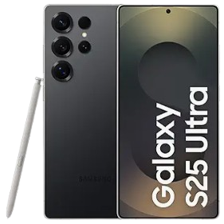

/*Clone-the-Card-HTML-CSS-Remix*/
<!DOCTYPE html>
<html lang="en">

<head>
    <meta charset="UTF-8">
    <meta name="viewport" content="width=device-width, initial-scale=1.0">
    <title>Amazon.in: Samsung S25 Ultra 5G</title>
    
</head>

<body>
    

        <!-- Phone image container -->
        

            
        

        <!-- Product content container -->
        

            
Samsung Galaxy S25 Ultra 5G Smartphone with Galaxy AI (Titanium Black, 12 GB RAM, 512 GB Storage),
                Titanium Frame, Snapdragon 8 Elite, 200MP Camera With Provisual...

            <!-- Star rating -->
            

                ★★★★★ 241
            

            <!-- Purchase info -->
            

                100+ bought in the past month
            

            <!-- Cost and discount -->
            

                ₹1,29,999
            

            

                (8% off)
            

            

                Save extra with No Cost EMI
            

            <!-- Delivery info -->
            

                FREE delivery <strong>Thu, 3 Jul</strong>
            

            

                Service: Installation
            

            <!-- Add to Cart button -->
            

                Add to Cart
            

            <!-- Other colors link -->
            

                
+5 other colors/patterns

            

        

    

</body>

</html>
